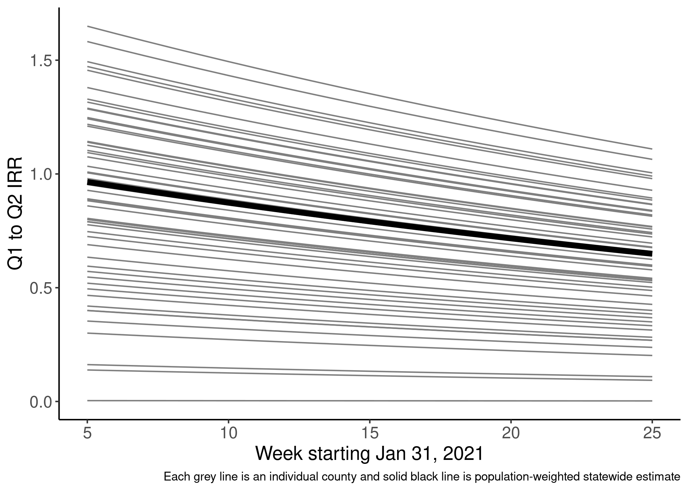
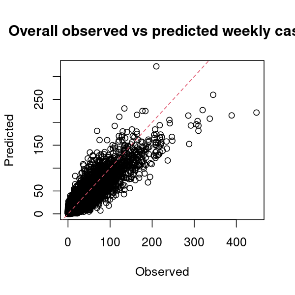
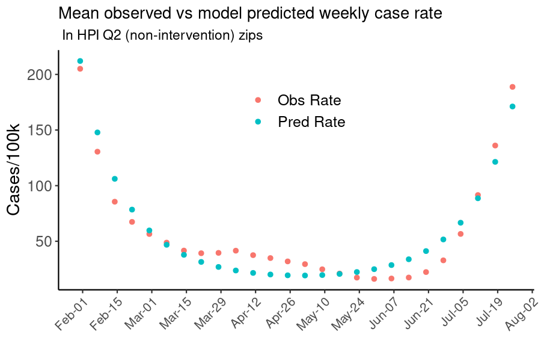
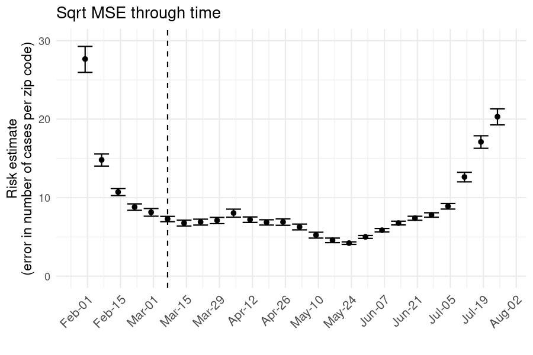

```{r setup, include=FALSE}
knitr::opts_chunk$set(echo = FALSE,
                      #eval = FALSE,
                      warning = FALSE,
                      message = FALSE)

library(tidyverse)
library(lubridate)
library(data.table)
library(lme4)
library(patchwork)

options(knitr.kable.NA = '')

```

```{r utils_data}
source(here::here("Utils/Plot_Utils.R"))

# Number of bootstrap samples for regressions 
n_boots <- 100

# Data ---------------------
zip_fin <- readRDS(here::here("data/zip_fin_vem.rds"))
weekly_zip_sum <- readRDS(here::here("data/weekly_zip_sum.RDS"))
county_pops <- readRDS(here::here("data/county_pop.RDS"))
```

# Background  
As part of the State of California's focus on health equity, vaccine allocation as of March 2, 2021 was determined by the Vaccine Equity Metric (VEM), derived from the Healthy Places Index. Specifically, zip codes in the lowest VEM quartile received double the allotment of vaccines as other quartiles. [Additional measures](https://www.gov.ca.gov/wp-content/uploads/2021/03/Equitable-Vaccine-Administration-Fact-Sheet.pdf) to ensure that vaccines allotted to these areas were administered to residents rather than more advantaged individuals in neighboring areas were also enacted. This analysis seeks to evaluate the impact of these efforts on covid-19 outcomes including cases, hospitalizations, and deaths.  

# Effect on vaccination rates  
```{r vax_rate_raw, fig.height=4, fig.width=6, fig.cap="Weekly vaccines administered per 100k population in early 2021. Points and errorbars indicate median and interquartile range of rate among zips within each vem quartile"}
weekly_zip_sum %>% 
  filter(date >= as.Date("2021-02-01"), date <= as.Date("2021-05-01")) %>% 
  group_by(date, vemquartile) %>% 
  summarise(med = median(vaxp100k),
            q25 = quantile(vaxp100k, 0.25),
            q75 = quantile(vaxp100k, 0.75)) %>% 
  ungroup() %>% 
  ggplot(aes(x = date, y = med, 
             ymin = q25, ymax = q75,
             col = as.factor(vemquartile),
             group = as.factor(vemquartile))) +
  geom_point(position = position_dodge(width = 5)) +
  geom_errorbar(position = position_dodge(width = 5)) +
  geom_vline(xintercept = ymd(20210308), lty = 2) +
  theme_minimal() +
  theme_here() +
  theme(axis.text.x = element_text(angle = 45)) +
  scale_x_date(date_breaks = "1 week",
               date_labels = "%b-%d") +
  scale_color_hpiq() +
  labs(x = "",
       y = "Vaccinations per 100k",
       col = "VEM\nQuartile")

```

```{r vax_rate_raw_cnty, fig.height=8, fig.width=12, fig.cap="Weekly vaccines administered per 100k population in early 2021 by county."}
weekly_zip_sum %>% 
  filter(date >= as.Date("2021-02-01"), date <= as.Date("2021-05-01")) %>%
  filter(county %in% (county_pops %>% filter(pop >= 1e5) %>% pull(county))) %>% 
  group_by(date, vemquartile, county) %>% 
  summarise(med = median(vaxp100k),
            q25 = quantile(vaxp100k, 0.25),
            q75 = quantile(vaxp100k, 0.75)) %>% 
  ungroup() %>% 
  ggplot(aes(x = date, y = med, 
             #ymin = q25, ymax = q75,
             col = as.factor(vemquartile),
             group = as.factor(vemquartile))) +
  geom_line() +
  #geom_errorbar(position = position_dodge(width = 5)) +
  geom_vline(xintercept = ymd(20210308), lty = 2) +
  facet_wrap(.~county, ncol = 6, nrow = 6) +
  theme_classic() +
  theme_here() +
  theme(axis.text.x = element_text(angle = 45, hjust = 1)) +
  scale_x_date(date_breaks = "1 month",
               date_labels = "%b-%d") +
  scale_color_hpiq() +
  labs(x = "",
       y = "Vaccinations per 100k",
       col = "VEM\nQuartile")

```
### Approach  

A difference in differences analysis using a poisson mixed effects model with a random intercept for county and main effects for binary vem quartile 1 status, binary intervention period (before/after March 8, 2021), and their interaction of the form:

$$\log\mathbf{E}(y_{ij}|\alpha_j)=\log(N_{ij})+(\beta_0+\alpha_j)+\beta_1Int+\beta_2After+\beta_3Int\times After$$

Where:
$$y_{ij}\sim Pois(\lambda)$$   

$$\alpha\sim\mathcal{N}(0,\sigma^2)$$
are fitted, where $\exp(\beta_3)$ is the difference in differences (DiD) coefficient--the ratio of rate ratios--indicating the change in vaccination rate in VEM Q1 zip codes compared to non-Q1 zip codes following March 8th.  

## Results   

```{r quartile_diffdiff}
  diffdiff_df <- zip_fin %>% 
    filter(date >= (as.Date("2021-03-08")-28) & date <= (as.Date("2021-03-08")+28)) %>%  # Four weeks before and after intervention implementation of March 8
    mutate(after = if_else(date < as.Date("2021-03-08"), 0, 1),
           int = if_else(vemquartile == 1, 1, 0)) %>% 
    group_by(zip, after) %>% 
    summarise(int = first(int),
              county = first(county),
              vax = sum(vax),
              pop = first(pop))
  
    diffdiff <- glmer(vax ~ (1|county) + after*int,
                      family = poisson(link = "log"),
                      offset = log(pop),
                      nAGQ = 100,
                      data = diffdiff_df)
  
    diffdiff_sum <- summary(diffdiff)
    
    diffdiff_irr <- exp(diffdiff_sum$coefficients[4,1])
    diffdiff_irr025 <- exp(diffdiff_sum$coefficients[4,1]+diffdiff_sum$coefficients[4,2]*qnorm(.025))
    diffdiff_irr975 <- exp(diffdiff_sum$coefficients[4,1]+diffdiff_sum$coefficients[4,2]*qnorm(.975))

# Function and implementation for pairwise quartile comparisons  
    
qtile_diff_diff <- function(q_tgt, q_ctrl, days_bef_aft){
  
  diffdiff_df <- zip_fin %>% 
    filter(vemquartile %in% c(q_tgt,q_ctrl)) %>% 
    filter(date >= (as.Date("2021-03-08")-days_bef_aft) & date <= (as.Date("2021-03-08")+days_bef_aft)) %>%  # Four weeks before and after intervention implementation of March 8
    mutate(after = if_else(date < as.Date("2021-03-08"), 0, 1),
           int = if_else(vemquartile == !!q_tgt, 1, 0)) %>% 
    group_by(zip, after) %>% 
    summarise(int = first(int),
              county = first(county),
              vax = sum(vax),
              pop = first(pop))
  
    diffdiff <- glmer(vax ~ (1|county) + after*int,
                      family = poisson(link = "log"),
                      offset = log(pop),
                      nAGQ = 100,
                      data = diffdiff_df)
  
    diffdiff_sum <- summary(diffdiff)
    
    diffdiff_irr <- exp(diffdiff_sum$coefficients[4,1])
    diffdiff_irr025 <- exp(diffdiff_sum$coefficients[4,1]+diffdiff_sum$coefficients[4,2]*qnorm(.025))
    diffdiff_irr975 <- exp(diffdiff_sum$coefficients[4,1]+diffdiff_sum$coefficients[4,2]*qnorm(.975))
  
    return(data.frame(qtgt = q_tgt,
                      qctrl = q_ctrl,
                      int_pd = days_bef_aft,
                      irr = diffdiff_irr,
                      irrlo = diffdiff_irr025,
                      irrhi = diffdiff_irr975))
}

# Estimate for all pairwise comparisons and across time frames of 1-4 weeks
diffdiff_vax_qtiles <- bind_rows(
  qtile_diff_diff(1,2,28),
  qtile_diff_diff(1,3,28),
  qtile_diff_diff(1,4,28),
  qtile_diff_diff(2,3,28),
  qtile_diff_diff(2,4,28),
  qtile_diff_diff(3,4,28),
  qtile_diff_diff(1,2,21),
  qtile_diff_diff(1,3,21),
  qtile_diff_diff(1,4,21),
  qtile_diff_diff(2,3,21),
  qtile_diff_diff(2,4,21),
  qtile_diff_diff(3,4,21),
  qtile_diff_diff(1,2,14),
  qtile_diff_diff(1,3,14),
  qtile_diff_diff(1,4,14),
  qtile_diff_diff(2,3,14),
  qtile_diff_diff(2,4,14),
  qtile_diff_diff(3,4,14),
  qtile_diff_diff(1,2,7),
  qtile_diff_diff(1,3,7),
  qtile_diff_diff(1,4,7),
  qtile_diff_diff(2,3,7),
  qtile_diff_diff(2,4,7),
  qtile_diff_diff(3,4,7)
)

```


Comparing VEM Q1 zip codes to all other Q2-Q4 zip codes, the vaccination rate increased by `r round(diffdiff_irr-1,4)*100` (95%CI: `r round(diffdiff_irr025-1,4)*100` - `r round(diffdiff_irr975-1,4)*100`) in the four weeks following the VEM Q1 vaccine allocation.    

```{r quartile_diffdiff_adj}
  diffdiff_prevax <- zip_fin %>% 
    filter(date < as.Date("2021-03-08") & date >= as.Date("2021-03-08")-28) %>% 
    mutate(after = 0,
           int = if_else(hpiquartile == 1, 1, 0)) %>% 
    group_by(zip, after) %>% 
    summarise(int = first(int),
              county = first(county),
              vax = sum(vax),
              pop = first(pop),
              prop_unvax = (1-vax/pop)*100)

  diffdiff_posvax <- zip_fin %>% 
    filter(date < as.Date("2021-03-08")+28 & date >= as.Date("2021-03-08")) %>% 
    mutate(after = 1,
           int = if_else(hpiquartile == 1, 1, 0)) %>% 
    group_by(zip, after) %>% 
    summarise(int = first(int),
              county = first(county),
              vax = sum(vax),
              pop = first(pop),
              prop_unvax = (1-vax/pop)*100 )

diffdiff_df_adj <- bind_rows(diffdiff_prevax,diffdiff_posvax)

diffdiff_adj <- glmer(vax ~ (1|county) + prop_unvax + after*int,
                          family = poisson(link = "log"),
                          offset = log(pop),
                          nAGQ = 100,
                          data = diffdiff_df_adj)

diffdiff_adj_sum <- summary(diffdiff_adj)

diffdiff_adj_irr <- exp(diffdiff_adj_sum$coefficients[5,1])
diffdiff_adj_irr025 <- exp(diffdiff_adj_sum$coefficients[5,1]+diffdiff_adj_sum$coefficients[5,2]*qnorm(.025))
diffdiff_adj_irr975 <- exp(diffdiff_adj_sum$coefficients[5,1]+diffdiff_adj_sum$coefficients[5,2]*qnorm(.975))


qtile_diff_diff_adj <- function(q_tgt, q_ctrl){
  

  diffdiff_prevax <- zip_fin %>% 
    #st_drop_geometry() %>% 
    filter(hpiquartile %in% c(q_tgt,q_ctrl)) %>% 
    filter(date < as.Date("2021-03-08") & date >= as.Date("2021-03-08")-28) %>% 
    mutate(after = 0,
           int = if_else(hpiquartile == !!q_tgt, 1, 0)) %>% 
    group_by(zip, after) %>% 
    summarise(int = first(int),
              county = first(county),
              vax = sum(vax),
              pop = first(pop),
              prop_unvax = (1-vax/pop)*100)

  diffdiff_posvax <- zip_fin %>% 
    filter(hpiquartile %in% c(q_tgt,q_ctrl)) %>% 
    filter(date < as.Date("2021-03-08")+28 & date >= as.Date("2021-03-08")) %>% 
    mutate(after = 1,
           int = if_else(hpiquartile == q_tgt, 1, 0)) %>% 
    group_by(zip, after) %>% 
    summarise(int = first(int),
              county = first(county),
              vax = sum(vax),
              pop = first(pop),
              prop_unvax = (1-vax/pop)*100 )

diffdiff_df_adj <- bind_rows(diffdiff_prevax,diffdiff_posvax)

diffdiff_adj <- glmer(vax ~ (1|county) + prop_unvax + after*int,
                          family = poisson(link = "log"),
                          offset = log(pop),
                          nAGQ = 100,
                          data = diffdiff_df_adj)

diffdiff_adj_sum <- summary(diffdiff_adj)

diffdiff_adj_irr <- exp(diffdiff_adj_sum$coefficients[5,1])
diffdiff_adj_irr025 <- exp(diffdiff_adj_sum$coefficients[5,1]+diffdiff_adj_sum$coefficients[5,2]*qnorm(.025))
diffdiff_adj_irr975 <- exp(diffdiff_adj_sum$coefficients[5,1]+diffdiff_adj_sum$coefficients[5,2]*qnorm(.975))

    return(data.frame(qtgt = q_tgt,
                      qctrl = q_ctrl,
                      irr = diffdiff_adj_irr,
                      irrlo = diffdiff_adj_irr025,
                      irrhi = diffdiff_adj_irr975))
}

diffdiff_adj_vax_qtiles <- bind_rows(
  qtile_diff_diff_adj(1,2),
  qtile_diff_diff_adj(1,3),
  qtile_diff_diff_adj(1,4),
  qtile_diff_diff_adj(2,3),
  qtile_diff_diff_adj(2,4),
  qtile_diff_diff_adj(3,4)
)

```

One potential cause of this is that there were fewer unvaccinated individuals in higher HPI areas due to high vaccination rates leading up to early March when the extra allocation to HPI Q1 occurred. To account for this, additional models including a main effect for the proportion of the population unvaccinated in each zip code are fitted. Adjusting for the proportion unvaccinated in the pre and post equity vaccine allocation, the vaccination rate in HPI Q1 zip codes increased by `r round(diffdiff_adj_irr-1,4)*100` (95%CI: `r round(diffdiff_adj_irr025-1,4)*100` - `r round(diffdiff_adj_irr975-1,4)*100`) when compared to zip codes in all other HPI quartiles.   


### Sensitivity Analyses  

#### Octiles  

Because HPI Q1 zip codes are inherently different across many factors than zip codes in other HPI quartiles, identifying suitable controls to compare HPI Q1 zip codes to is challenging. This sensitivity analysis relies on the hard cutoff in HPI scores that determine which zip codes are defined as Q1. It assumes that zip codes labeled as Q1 due to an HPI score just below the 25th percentile are reasonably similar to zip codes that are labeled as Q2 and just above the 25th percentile. HPI scores are divided into octiles and zips classified as Q1 in the 2nd octile (corresponding to HPI scores in the 12.5th to 25th percentiles) are compared to zips in the third octile (corresponding to HPI scores in the 25th to 37.5th percentile) not classified as Q1. [Sensitivity analyses comparing e.g. 20th-25th percentile to 25th-30th percentile also to be conducted].

```{r oct_diffdiff}
oct_diffdiff_df <- zip_fin %>% 
  #st_drop_geometry() %>% 
  filter(hpioctile %in% c(2,3), !is.na(county)) %>% 
  filter(date >= (as.Date("2021-03-08")-28) & date <= (as.Date("2021-03-08")+28)) %>%  # Four weeks before and after intervention implementation of March 8
  mutate(after = if_else(date < as.Date("2021-03-08"), 0, 1)) %>% 
  group_by(zip, after) %>% 
  summarise(int = first(hpio2),
            county = first(county),
            vax = sum(vax),
            pop = first(pop))

oct_diffdiff <- glmer(vax ~ (1|county) + after*int,
                      family = poisson(link = "log"),
                      offset = log(pop),
                      nAGQ = 100,
                      data = oct_diffdiff_df)

oct_diffdiff_sum <- summary(oct_diffdiff)

oct_diffdiff_df$vax_pred  <-  exp(predict(oct_diffdiff))

oct_diffdiff_irr <- exp(oct_diffdiff_sum$coefficients[4,1])
oct_diffdiff_irr025 <- exp(oct_diffdiff_sum$coefficients[4,1]+oct_diffdiff_sum$coefficients[4,2]*qnorm(.025))
oct_diffdiff_irr975 <- exp(oct_diffdiff_sum$coefficients[4,1]+oct_diffdiff_sum$coefficients[4,2]*qnorm(.975))

```

```{r oct_diffdiff_vax_plot, include = FALSE, fig.height=3, fig.width=4.5, fig.cap="Vaccination rate in HPI octile 2 and octile 3 zip codes in the four weeks before and after March 8 equity allocation. Not crazy about this figure, doesn't clearly show the effect"}
oct_diffdiff_df %>% 
  mutate(vax_pred_p100k = vax_pred/pop*1e5) %>% 
  group_by(after, int) %>% 
  summarise(mn = mean(vax_pred_p100k),
            se = sqrt(var(vax_pred_p100k)/length(vax_pred_p100k))) %>% 
  ggplot(aes(x = as.factor(after), y = mn, 
             ymin = mn - se, ymax = mn+se,
             col = as.factor(int), group = int)) +
    geom_point(size = 2) +
    geom_errorbar(width = 0.05) +
    geom_line(lty = 2) +
    theme_minimal() +
    theme_here() +
    scale_x_discrete(breaks = c(0,1),
                     labels = c("Before", "After")) +
    scale_color_manual(breaks = c(1,0),
                       values = c("royalblue", "lightblue"),
                       labels = c("HPI Q1", "HPI Q2")) +
    scale_y_continuous(limits = c(1e4,2.5e4)) +
    labs( x = "", y = "Vax per 100,000", col = "")
    
```

```{r oct_diffdiff_adj}
# Possible that this could be driven by the fact that higher HPI quartiles had higher proportions of population vaccinated prior to early March, therefore fewer people eligible to be vaccinated. To adjust for this, include a main effect in the regression for proportion of population unvaxxed by March 8

oct_diffdiff_prevax <- zip_fin %>% 
  #st_drop_geometry() %>% 
  filter(hpioctile %in% c(2,3)) %>% 
  filter(date < as.Date("2021-02-08")) %>% 
  mutate(after = 0) %>% 
  group_by(zip, after) %>% 
  summarise(int = first(hpio2),
            county = first(county),
            vax = sum(vax),
            pop = first(pop),
            prop_unvax = (1-vax/pop)*100)

oct_diffdiff_posvax <- zip_fin %>% 
  #st_drop_geometry() %>% 
  filter(hpioctile %in% c(2,3)) %>% 
  filter(date < as.Date("2021-03-08")) %>% 
  mutate(after = 1) %>% 
  group_by(zip, after) %>% 
  summarise(int = first(hpio2),
            county = first(county),
            vax = sum(vax),
            pop = first(pop),
            prop_unvax = (1-vax/pop)*100 )

oct_diffdiff_df_adj <- oct_diffdiff_df %>% 
  left_join(bind_rows(oct_diffdiff_prevax,oct_diffdiff_posvax) %>% 
              dplyr::select(zip,after,prop_unvax),
            by = c("zip", "after"))

oct_diffdiff_adj <- glmer(vax ~ (1|county) + prop_unvax + after*int,
                          family = poisson(link = "log"),
                          offset = log(pop),
                          nAGQ = 100,
                          data = oct_diffdiff_df_adj)

oct_diffdiff_adj_sum <- summary(oct_diffdiff_adj)

oct_diffdiff_adj_irr <- exp(oct_diffdiff_adj_sum$coefficients[5,1])
oct_diffdiff_adj_irr025 <- exp(oct_diffdiff_adj_sum$coefficients[5,1]+oct_diffdiff_adj_sum$coefficients[5,2]*qnorm(.025))
oct_diffdiff_adj_irr975 <- exp(oct_diffdiff_adj_sum$coefficients[5,1]+oct_diffdiff_adj_sum$coefficients[5,2]*qnorm(.975))

```

HPI Q1 vaccine allocation led to a `r (round(oct_diffdiff_irr,3)-1)*100`% (95%CI: `r (round(oct_diffdiff_irr025,3)-1)*100`% - `r (round(oct_diffdiff_irr975,3)-1)*100`%) increase in vaccination rate in HPI Q1 zip codes in the 12.5th-25th HPI percentile compared to HPI Q2 zip codes in the 25th-37.5th HPI percentile in the four weeks after the vaccine equity allotment was implemented in early March 2021. It's possible this effect could be driven by higher HPI quartiles having higher proportions of their population vaccinated prior to early March, therefore fewer people eligible to be vaccinated. To adjust for this, we include a main effect in the regression for the proportion of population unvaxxed by March 8, which actually amplifies the estimate to a `r (round(oct_diffdiff_adj_irr,3)-1)*100`% (95%CI: `r (round(oct_diffdiff_adj_irr025,3)-1)*100`% - `r (round(oct_diffdiff_adj_irr975,3)-1)*100`%) increase in vaccination rate in HPI Q1 zip codes in the 12.5th-25th HPI percentile. 

#### Negative controls   
Since there was no HPI allocation in HPI Q2-Q4, we wouldn't expect any significant relative increases in their vaccination rates. This means we can use them as negative controls to check that the significant effect comparing Q1 to Q2 (or octile 2 to octile 3) is caused by the intervention (extra vax allocation) and not some unmeasured confounder. The below table shows the DiD estimates for all pairwise comparisons across VEM quartiles for a 4-week pre-post comparison period. The increase among Q1 zip codes was relatively consistent regardless of the comparison group, though there were also statistically significant increases in the vaccination rate among Q2 zip codes when compared to Q3 and Q4 zip codes. If we crudely subtract away this "residual" effect in Q2 from the Q1:Q3 and Q3:Q4 comparisons, we arrive at a fairly consistent high-teens % increase in vaccination rate in Q1.

```{r negctrl_tab}
diffdiff_vax_qtiles %>% 
  filter(int_pd == 28) %>% 
  mutate(irr_sum = paste0(round(irr, 2), " (",
                          round(irrlo, 2), " - ",
                          round(irrhi, 2), ")")) %>% 
  dplyr::select(qtgt, qctrl, irr_sum) %>% 
  pivot_wider(names_from = qtgt, values_from = irr_sum) %>% 
  knitr::kable(row.names = FALSE,
               col.names = c("Ref Quartile", "VEM Q1", "VEM Q2", "VEM Q3"),
               caption = "Difference in differences coefficient for unadjusted models comparing all combinations of VEM quartiles")

```

# Effect on COVID-19 Outcomes  
Measuring the impact on COVID-19 cases, hospitalizations, and deaths is more challenging because of time delays between the intervention (extra vaccine allocation) and its effect on COVID-19 outcomes. Because of the 2-dose vaccine sequence, subsequent delays between second vaccine dose and "full immunity", and additional delays between potential COVID-19 exposure, infection, testing, hospitalization, and death, there is not a clear time point or even time frame in which to expect a decrease in COVID-19 outcomes in VEM Q1 zip codes that received the extra vaccine allocation. Additionally, higher prior case rates could influence rates of future COVID-19 outcomes due to natural immunity, and underlying variability in exposure/risk could confound effects of the equity allocation on COVID-19 outcomes.

These factors make causal estimation of the effect of the equity allocation on COVID-19 outcomes challenging, but the proposed approach using an interrupted time series approach is described below.  

## Approach 1  
Using reported estimates of vaccine efficacy towards becoming a symptomatic case, hospitalization, and death, we estimate the number of cases, hospitalizations, and mortalities averted by the vaccine equity intervention by... [combine VE with extra vax in VEM Q1]

## Approach 2  
We take an interrupted times series approach to estimate the effect of the extra vaccine allotment in VEM Q1 zip codes on COVID-19 cases, hospitalizations, and deaths compared to VEM Q2 zip codes in the period following the intervention implemented March 7, 2021. A poisson generalized linear model with fixed effects for intervention status in zip code $i$ at week $t$, week of observation (with $t_0$ the week beginning Jan 31, 2021 and $t_{25}$ the week ending July 31, 2021), and their interaction of the form:
$$\log\mathbb{E}(y_{it}|\mathbf{X}_{it})=\log(N_{i})+\beta_0+\beta_1Int_{it}+\beta_2t+\beta_3t\times Int_{it}+\beta_4t^2+\beta_5County_i+\beta_6VEM_i+ \epsilon$$

where:

$$y_{it}\sim Pois(\lambda_{it})$$   

are fitted. Week squared, county, and VEM quartile are included to, respectively, adjust for non-linear time trends in the outcome of interest, account for county-level differences in transmission and mitigation efforts, and account for inherent differences between VEM Q1 and Q2 zip codes independent of the intervention. We are interested in the incidence rate ratio (IRR) between quartile 1 and quartile 2 zip codes in each week following the intervention ($t>4$), estimated as $\mathrm{IRR}=\exp(\beta_1+\beta_3t)\space\mathrm{for}\space t\in \{5,25\}$. Inference derived from non-parametric bootstrap or delta method.  

\newpage

## Cases Results   
```{r case_rate_raw, fig.height=5, fig.width=9, fig.cap="Weekly vaccines administered per 100k population in early 2021. Points and errorbars indicate median and interquartile range of rate among zips within each vem quartile"}
weekly_zip_sum %>% 
  filter(date >= as.Date("2021-02-01"), date <= as.Date("2021-07-31")) %>% 
  group_by(date, vemquartile) %>% 
  summarise(med = median(casep100k),
            q25 = quantile(casep100k, 0.25),
            q75 = quantile(casep100k, 0.75)) %>% 
  ungroup() %>% 
  ggplot(aes(x = date, y = med, 
             ymin = q25, ymax = q75,
             col = as.factor(vemquartile),
             group = as.factor(vemquartile))) +
  geom_point(position = position_dodge(width = 5)) +
  geom_errorbar(position = position_dodge(width = 5)) +
  geom_vline(xintercept = ymd(20210308), lty = 2) +
  theme_minimal() +
  theme_here() +
  theme(axis.text.x = element_text(angle = 45)) +
  scale_x_date(date_breaks = "1 week",
               date_labels = "%b-%d") +
  scale_color_hpiq() +
  labs(x = "",
       y = "Cases per 100k",
       col = "VEM\nQuartile")

```



There was an overall decreasing trend in the case IRR over the observation period between Q2 and Q1 VEM zip codes with considerable variability by county. Counties in which the IRR remained >1 suggest that Q1 VEM residents had a higher case rate than Q2 residents for the entire observation period, but this disparity lessened following the vaccine equity allocation. Counties in which the IRR was <1 for the entire observation period suggest that Q1 residents had lower case rates than Q2 residents even before the vaccine equity allocation. 

Attributing changes in case rates to the vaccine equity allocation with confidence still requires more investigation. Some potential areas of concern and potential solutions to address them include:  

* Variability in natural immunity prior to vaccine rollout -> adjust for prior case rate  
* Variability in testing -> adjust for test rate  
* Variability in exposure/transmission rate -> adjust for $\mathcal{R}_t$ or something? This seems kind of circular...  
* Model formulation: is ITS right approach given delays between vaccine admin and effects on case rates?  
* Model performance/structure  
  - B-spline on time rather than $t^2$ term?  
  - If using B-spline, ok to also include week and week x intevention main effects?  
* What's the best counterfactual approach?  
  - Goal is to determine what COVID-19 outcomes would have been in absence of equity allocation and compare to what was observed  
  - Synthetic controls?  
  - Some snazzy longitudinal tmle/ensemble superlearner model?  
* Matched analysis of within county Q1:non-Q1 zip codes  
  - Controls for county-level effects  
  - Presumably controls for transmission reasonably well  


# Apendix/Supplement  

### Cases Model performance  

  





